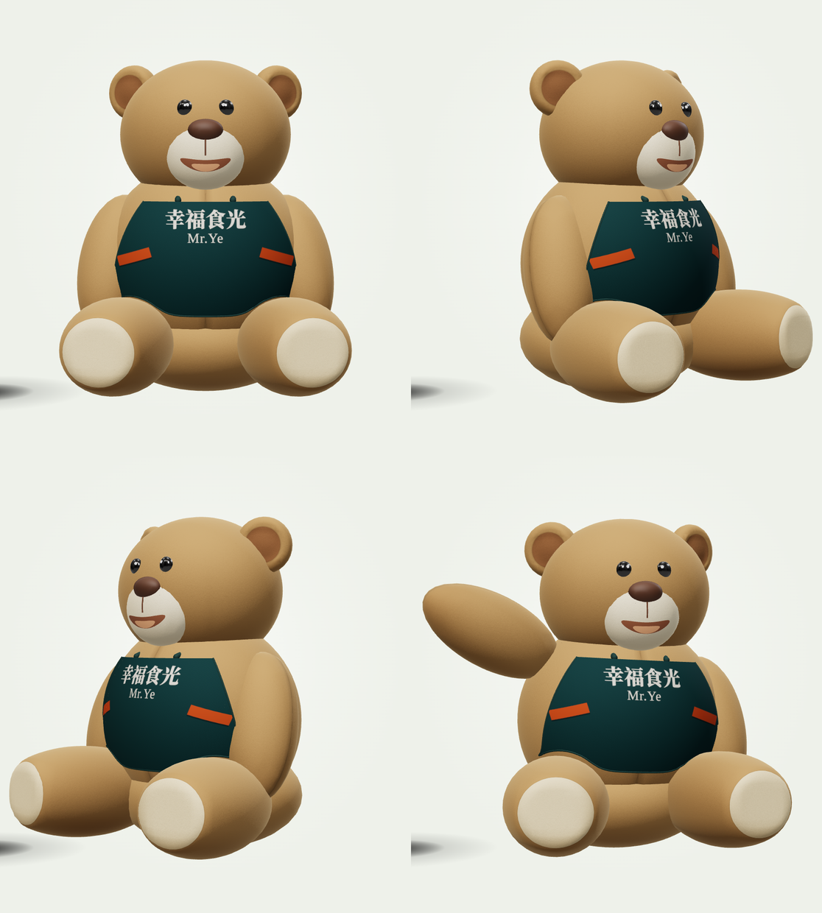
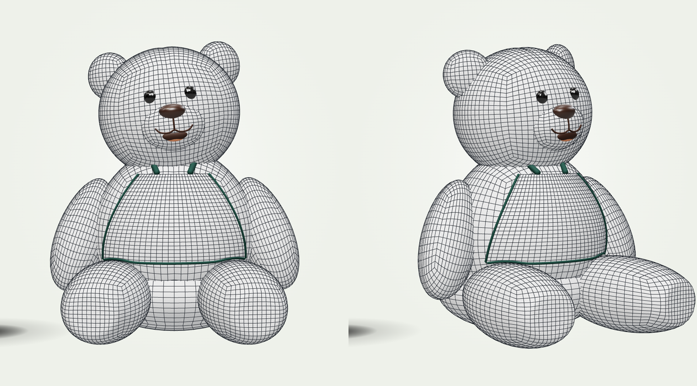

# Mr Ye 幸福食光 — web site

## 🌐 Live site: **https://yahyaalaoui2002.github.io/Mr-Ya-web-site/**
Only the site is published: one self-contained `index.html`, built from `src/` by `.github/workflows/pages.yml` on every push to `main`.

One-page site for a bubble tea and Hubei street-food restaurant in Paris 13e: an interactive **3D bubble tea builder** (Three.js r159, no framework, no bundler), a **rigged, animated teddy-bear mascot** in the Mr Ye apron, and the menu as an oval roulette.



## The bear
A plush built the way a plush is sewn: separate all-quad pieces (torso, pelvis, head, muzzle, ears, arms, legs with flat cream soles) with stitched seams, hung on a real **bone rig** (`THREE.Bone`): `root > hips > spine > neck > Head > earL/earR`, `spine > shoulderL/R`, `hips > hipL/R`. The **Head is its own node** (head, muzzle, ears, eyes, nose, mouth) and follows the pointer; the branded apron (幸福食光 / Mr.Ye, orange pocket slits) hangs on the spine.
Animated with `AnimationMixer` clips: idle breathing, **wave** (it greets you once; click or tap the bear to make it wave), cheer, nod, tilt, plus blinking.



```js
mryeCup.bear.play('wave')      // 'wave' | 'cheer' | 'nod' | 'tilt'
mryeCup.bear.setWire(true)     // grey clay + the quad edges of every piece
mryeCup.bear.setBones(true)    // show the skeleton
mryeCup.bear.rig               // the THREE.Bone nodes (hips, spine, neck, Head, earL, ...)
```
The developer bench (`npm run build && npm run serve`, then open `/lab.html`; it is not published) has buttons for all of it (Salut, Hourra, Oui, Curieux, Fil de fer, Squelette).

## Quick start
```
node build.mjs                 # -> dist/index.html (single file), dist/lab.html, dist/bubbletea-3d.js
python3 -m http.server 8080 --directory dist     # then open http://localhost:8080
```
Needs internet in the browser (Three.js from jsDelivr, fonts from Google).

## Tests
```
pip install -r requirements.txt && playwright install chromium
npm test            # or: npm run test:fast  (containment, roulette, rig, bear, stress)
```

## Put it online (GitHub Pages)
`.github/workflows/pages.yml` builds the site (`node build.mjs`) and publishes ONLY `dist/index.html` (as the site's `index.html`) on every push to `main`: no lab bench, no docs, no tests.
1. One-time: **Settings → Pages → Build and deployment → Source: GitHub Actions**.
2. Merge to `main` (or run the workflow by hand from the **Actions** tab).
3. The site is live at `https://<user>.github.io/<repo>/` (only `index.html` is published).

Using it with **Claude Code**: open this folder, read `CLAUDE.md` (project memory), then `docs/BACKLOG.md`.
