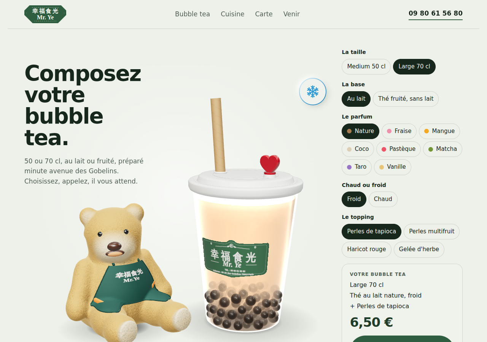

# Mr Ye 幸福食光 — web site

One-page site for a bubble tea and Hubei street-food restaurant in Paris 13e: an interactive **3D bubble tea builder** (Three.js r159, no framework, no bundler), a teddy-bear mascot, and the menu as an oval roulette.



## Quick start
```
node build.mjs                 # -> dist/index.html (single file), dist/lab.html, dist/bubbletea-3d.js
python3 -m http.server 8080 --directory dist     # then open http://localhost:8080
```
Needs internet in the browser (Three.js from jsDelivr, fonts from Google).

## Tests
```
pip install -r requirements.txt && playwright install chromium
npm test            # or: npm run test:fast
```

## Put it online (GitHub Pages)
1. Create a **public** repository on github.com, push this folder (`git remote add origin <url> && git push -u origin main`).
2. **Settings → Pages → Deploy from a branch → `main` / root**, and move `dist/index.html` to the repo root as `index.html` (or serve `/dist`: add a GitHub Action, or commit `dist/` and set the folder).
3. The site is live at `https://<user>.github.io/<repo>/`.

Using it with **Claude Code**: open this folder, read `CLAUDE.md` (project memory), then `docs/BACKLOG.md`.
